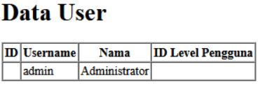

## JOBSHEET 04
# MODEL dan ELOQUENT ORM

### NAMA : Raffi Ilham Maulana
### NIM : 2241720226
### ABSEN : 24

#

## A. PROPERTI $fillable DAN $guarded

### Praktikum 1 $fillable

1. Untuk langkah 4 dan 5 hasilnya error

### Praktikum 2.1 Retriving Single Models

1. Langkah 1 dan 2  
   
2. Langkah 4  menggunakan klausa Where yang mendefinisikan kondisi , sehingga tidak ada kesalahan.  
   
3. Tidak ada kesalahan pada langkah  6 karena ada juga syaratnya.  
   
4. Untuk langkah ke 8  
   
5. Untuk langkah ke 10
   

### Praktikum 2.2 Not Found Exceptions

1. Untuk langkah ke 1  
   
2. Untuk langkah ke 3
   

### Praktikum 2.3 Retreiving Aggregates

1. Untuk langkah 1  
   
2. Ubah script pada view  
   

### Praktikum 2.4 Retreiving or Creating Models

1. Untuk langkah 1 dan 2  
   
2. Untuk langkah 4 didalam m_user ada user baru bernama manager dua dua  
   
3. Untuk langkah 6  
   
4. Untuk langkah 8 didalam m_user ada user baru bernama manager tiga tiga  
   
5. Untuk langkah 9  
   

### Praktikum 2.5 Atrribute Changes

1. Untuk langkah 1  
   
2. Untuk langkah 3  
   

### Praktikum 2.6 Create, Read, Update, Delete (CRUD)

1. Untuk langkah 1 dan 2  
   
2. Untuk langkah 4 s/d 6  
   
3. Untuk langkah 8 dan 9 disini saya menambahkan user dengan nama manager1111  
   
4. Untuk langkah 11 s/d 13  
  
5. Untuk langkah 15 dan 16 dari nama manager1111 saya ubah menjadi manager1000  
  
6. Untuk langkah 18 dan 19 Data dengan nama manager1000 hilang karena saya hapus  
  

### Praktikum 2.7 Relationship

1. Untuk langkah 2  

